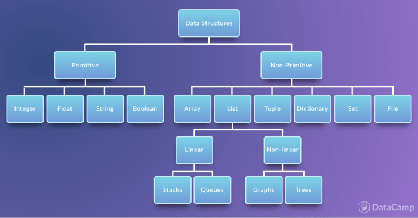

# Data Structure and Types

Python language does not specify how exactly the memory management should be implemented.

Everything in Python is passed and assigned ```by value```.

**Primitive Data Structures**
* Integer
* Float
* Boolean
* String

**Non-Primitive Data Structures**
* Array
* List
* Tuple
* Dictionary
* Set
* File




Function ```type()``` can display the type of the value:

```bash
>>> type(10)
<class 'int'>

>>> type("hello world!")
<class 'str'>

>>> type(True)
<class 'bool'>
```


<br />
<br />

## Non-Primitive Data Structures

### Array
Arrays are supported by the array module and need to be imported.

```bash
>>> import array as arr
```

All the entries in an array must be of the same data type. The data type is specified using a type code. 

```bash
>>> marks = arr.array("I", [95, 80, 90])
>>> temps = arr.array("f", [10.5, 18.3])

>>> type(marks)
<class 'array.array'>
```

Arrays are not very popular in Python, and ```Lists``` are a better substitute.

However, Arrays can be helpful in certain cases. For instance, because Arrays only hold one type pf data, some methods are only available for them. For example, converting all the contents to String, etc.

The popular ```NumPy''' library provides a different and much more efficient Array type.

<br />

### Lists
Unlike Arrays, Lists are built-in.


```bash
>>> myList = []
>>> type(myList)
<class 'list'>
```

Lists can be used to store collection of heterogeneous items. 

```bash
>>> myList = list([99, 'Alfie', 10.5])
```

List values can be accessed with a ```zero based``` index.

```bash
>>> myList[0]
99
```

Lists are mutable and their contents can be modified.

```bash
>>> myList[1] = "John"
>>> myList
[99, 'John', 10.5]
```

Many built-in methods are available to work with and manipulate lists. This will be discussed in *built-in functions* sections.

Items are added or removed from a ```List``` according to ```Stacks (LIFO)``` concept.

```bash
>>> stack = ["Red", "Green"]
```

```bash
>>> stack.append("Blue")
>>> print(stack)
["Red", "Green", "Blue"]
```

```bash
>>> stack.pop()
>>> stack.pop()
>>> print(stack)
["Red"]
```

<br>

#### Graphs

> A graph are networks consisting of nodes or vertices which may or may not be connected to each other. The lines or the path that connects two nodes is called an edge. If the edge has a particular direction of flow, then it is a directed graph, with the direction edge being called an arc. Else if no directions are specified, the graph is called an undirected graph.
<br>
datacamp.com

```py
graph = {"Alfie": ["Tom", "John"],
         "Tom": ["Jerry"],
         "John": ["Alfie", "Jerry"]
         }

def define_edges(graph):
    edges = []
    for vertices in graph:
        for neighbour in graph[vertices]:
            edges.append((vertices, neighbour))
    return edges

print(define_edges(graph))
```

```bash
[('Alfie', 'Tom'), ('Alfie', 'John'), ('Tom', 'Jerry'), ('John', 'Alfie'), ('John', 'Jerry')]
```

<br>

#### Tree
Tree can be structured using a combination of other data structures.

<br>

### Tuples
```Tuple``` is an immutable ```list```. It is not possible to delete, add or edit any values inside a tuple once it is defined. 

This is useful when manipulation of the collection data is not desirable when passing it to other methods.

```bash
>>> myTuple_1 = "Alfie","Jane","John"
>>> myTuple_2 = (10.5,15,18)

>>> type(myTuple_1)
<class 'tuple'>

>>> myTuple_1[1]
'Jane'

>>> myTuple_2[0] = 1
TypeError: 'tuple' object does not support item assignment
```

<br>

### Dictionary
Dictionaries are made up of key-value pairs. ```key``` is used to identify the item and the ```value``` holds the value.

Keys should be unique in a dictionary.

```bash
>>> myDict = {"Alfie": 85, "Jane": 95}

>>> type(myDict)
<class 'dict'>

>>> myDict["Alfie"]
85

>>> del myDict["Alfie"]
>>> myDict
{'Jane': 95}
```

<br>

### Sets
Sets are a collection of unique objects. Set is a mutable and unordered list.

```bash
>>> mySet = {"apple", "banana", "cherry"}

>>> type(mySet)
<class 'set'>
```

<br>

### Files
```File``` refers to data stored in computer.

<br />
<br />

## Other Data Structures

### Complex number
Are specified as ```<real-part>+<imaginary-part>j```:

```bash
>>> 10 + 2j
(10+2j)

>>> x = 10 + 2j
>>> x.real
10.0
>>> x.imag
2.0
>>> x.conjugate()
(10-2j)
```

Complex number can also get created using complex() function:

```bash
>>> complex(10, 2)
(10+2j)
```

Complex numbers are useful in many applications related to mathematics and are mostly used where we define something using two real numbers. For example, a circuit element that is defined by Voltage (V) and Current (I).

```bash
>>> abs(10+2j)
10.198039027185569
```

The absolute value of a complex number ```x+yi``` is ```sqrt((x^2) + (y^2))```.

<br />